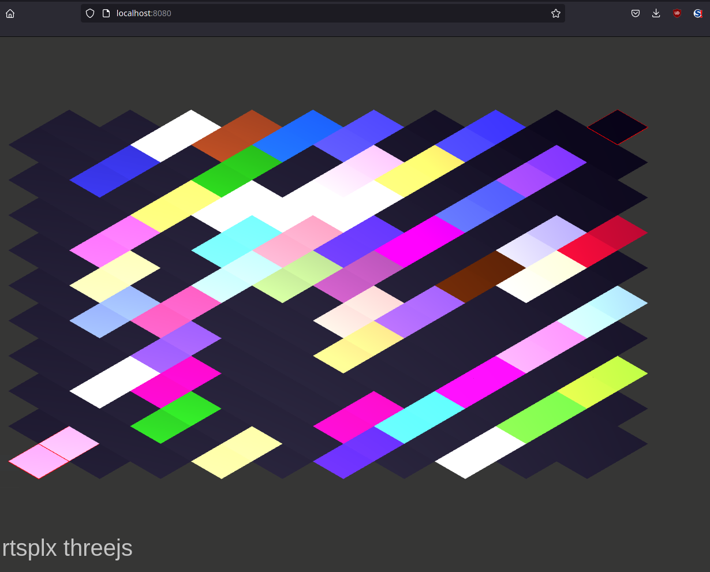
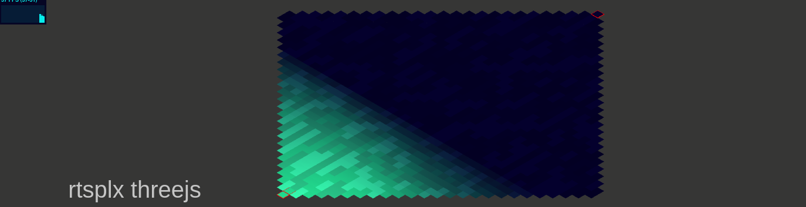
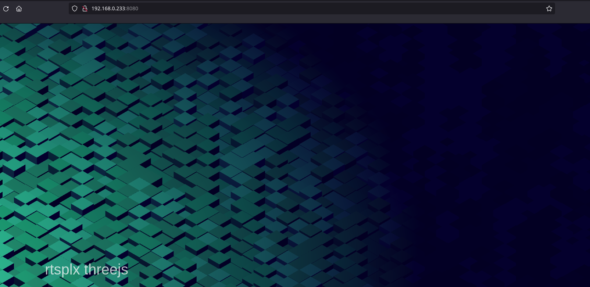

# threejs experiments

This repo renders isometric tiles to the screen through threejs with the text 'rtsplex threejs' representing the HUD

### To-do
- Add randomize tile color button to HUD that currently only displays text
- Implement scrollable tile map
- Implement cylinder units
- Implement units 'walking' to a destination on drag-select and click
- responsive UI, async

### Demo

#### Added more grid-like tiling

#### Added grass-like material

#### Added noise

