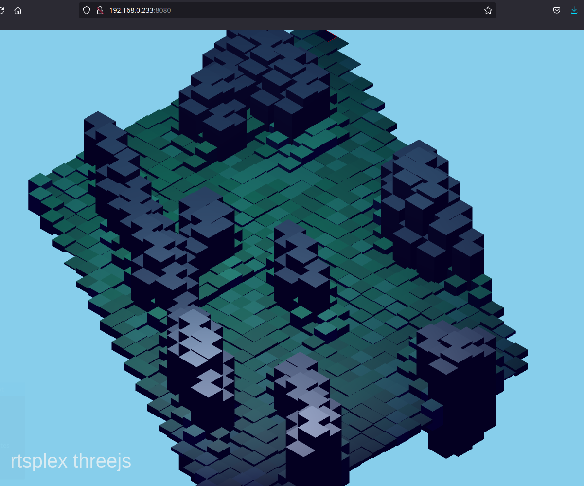
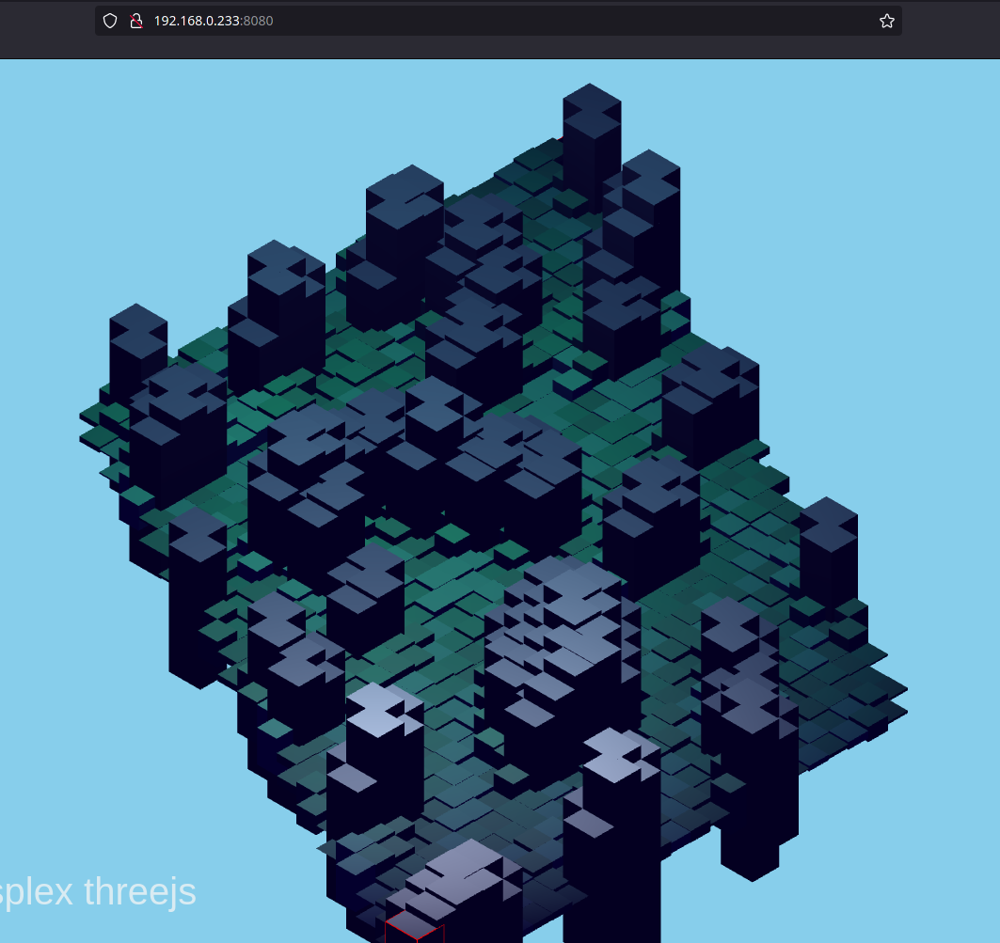
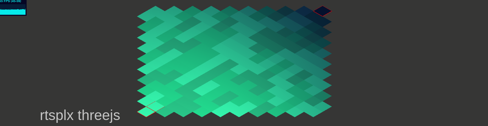

# threejs experiments

This repo renders isometric tiles to the screen through threejs with the text 'rtsplex threejs' representing the HUD

### Dependencies
 - Isometric Tiles
   - https://www.npmjs.com/package/three
 - Environment (Perlin Noise) 
   - https://github.com/josephg/noisejs
 - Performance 
   - https://github.com/mrdoob/stats.js

### To-do
- Implement scrollable tile map
- Implement cylinder units
- Implement units 'walking' to a destination on drag-select and click
- responsive UI, async

### Demo

In-progress pictures of this threejs demo are below :)

#### Added perlin mountains

#### Added noise

#### Added more grid-like tiling

#### Added pannable Orbit Controls

